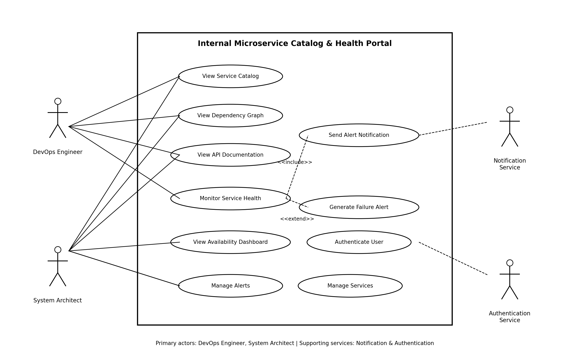

# Internal Microservice Catalog & Health Portal

## PES University – Department of CSE

**Lab 1: Requirements Engineering & UML Use-Case Modelling**

---

## 1. Problem Statement

### Problem Statement #42 – Developer Tools & IT Operations

The **Internal Microservice Catalog & Health Portal** is an enterprise developer portal designed to map microservice dependencies, aggregate API documentation, and perform automated periodic health checks with downtime alerts.

The system helps DevOps Engineers and System Architects monitor and manage microservices efficiently.

---

## 2. Objectives

The main objectives of the system are:

* Maintain a centralized catalog of registered microservices.
* Display dependencies between microservices.
* Provide searchable API documentation.
* Monitor microservice health periodically.
* Calculate rolling 24-hour service availability.
* Record health probe results.
* Generate alerts after consecutive service failures.
* Provide secure and authorized access to operational information.

---

## 3. Actors

### Primary Actors

* **DevOps Engineer**
* **System Architect**

### Supporting Actors / Services

* **Notification Service**
* **Authentication Service**

---

## 4. Functional Requirements

The system contains the following functional requirements:

| ID     | Requirement                                                           | Priority |
| ------ | --------------------------------------------------------------------- | -------- |
| FR-001 | Ping registered microservice health endpoints at 30-second intervals. | High     |
| FR-002 | Calculate and display rolling 24-hour availability.                   | High     |
| FR-003 | Store health probe timestamp, status, status code and latency.        | High     |
| FR-004 | Generate and dispatch an alert after three consecutive failed probes. | High     |
| FR-005 | Provide searchable API documentation for registered microservices.    | Medium   |

Detailed requirements, acceptance criteria and rationale are available in [Requirements.md](Requirements.md).

---

## 5. Non-Functional Requirements

| ID      | Type        | Priority |
| ------- | ----------- | -------- |
| NFR-001 | Performance | High     |
| NFR-002 | Security    | High     |

### NFR-001 – Performance

The dependency graph viewer should smoothly support architectures containing up to 200 services.

### NFR-002 – Security

The system should use secure communication, authentication, authorization and role-based access control.

---

## 6. UML Use-Case Diagram

The UML diagram represents the system boundary, actors, primary use cases and relationships including `<<include>>` and `<<extend>>`.



---

## 7. Core Use Case

### UC-001 – Monitor Service Health

**Primary Actor:** DevOps Engineer

The use case allows the DevOps Engineer to monitor the health and availability of registered microservices.

The system periodically performs health probes, stores the results, calculates availability and generates an alert when three consecutive health probes fail.

Detailed flow specification is available in [Use_Case_Flow_Specification.md](Use_Case_Flow_Specification.md).

---

## 8. Repository Contents

```text
Internal-Microservice-Catalog-Health-Portal/
│
├── README.md
├── Requirements.md
├── Use_Case_Flow_Specification.md
└── UML_Use_Case_Diagram.png
```

---

## 9. UML Relationships

The use-case diagram contains:

* `<<include>>` relationship between **Monitor Service Health** and **Send Alert Notification**
* `<<extend>>` relationship between **Generate Failure Alert** and **Monitor Service Health**

---

## 10. Conclusion

The proposed Internal Microservice Catalog & Health Portal provides a centralized solution for discovering, documenting and monitoring enterprise microservices. It improves operational visibility, service reliability and incident response through automated health monitoring and alert generation.
